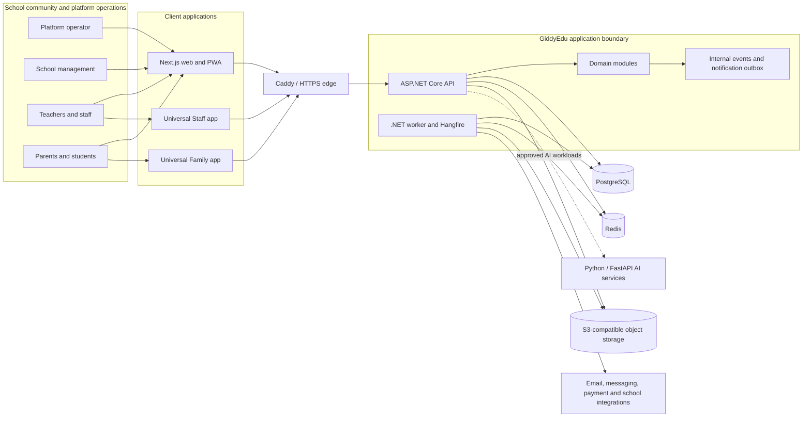

# GiddyEdu

GiddyEdu is a modern, multi-tenant school management system and education ERP
for nursery, primary and secondary schools in Nigeria. It gives proprietors,
school administrators, teachers, staff, parents and students one secure
platform for managing the complete school lifecycle across one or multiple
campuses.

Built for the operational needs of Nigerian schools, GiddyEdu brings together
online admissions, student information, academic sessions and classes, staff
management, parent and student portals, fees and payments, communication,
reporting, mobile access and offline-friendly workflows. Each school receives
its own branded workspace with permission-based access, configurable features
and strict tenant data isolation.

The product roadmap covers 47 commercial suites organised into shared
engineering domains, allowing GiddyEdu to grow from essential school
administration software into a complete school ERP without fragmenting school
data across disconnected applications.

## Core Stack

### Backend
- .NET 10
- ASP.NET Core
- Entity Framework Core
- PostgreSQL
- Redis
- Hangfire

### Web
- Next.js
- TypeScript
- Tailwind CSS
- shadcn/ui
- TanStack Query

### Mobile
- React Native
- Expo
- TypeScript

### AI
- Python
- FastAPI

### Infrastructure
- Docker
- Docker Compose
- Caddy
- S3-compatible object storage
- GitHub Actions
- OpenTelemetry

## Architecture

GiddyEdu is an API-first, multi-tenant SaaS platform delivered as a modular
monolith. The web portals and mobile applications are clients of one
authoritative backend: business rules, tenant isolation, permissions and
subscription entitlements are enforced by the API rather than trusted to a
client.

### System context

The dashed AI connection represents the planned integration boundary. AI is
assistive and does not become the authority for grades, permissions, tenant
access or decisions affecting students.

### Application structure

The ASP.NET Core application is deployed as one API and one background-worker
runtime, while its code is divided into explicit business modules. These
modules own their domain rules and reuse canonical entities instead of creating
suite-specific copies.

| Boundary | Responsibility |
| --- | --- |
| Platform and SaaS core | Tenants, campuses, identity, subscriptions, entitlements, feature flags, configuration, files, audit and integrations |
| Student lifecycle | Admissions, applicants, students, guardians, enrolment, progression and academic documents |
| Academic management | Academic years, terms, stages, classes, subjects, teaching and later assessment capabilities |
| Workforce management | Staff profiles, employment records, qualifications, assignments and staff services |
| Finance and commercial operations | School fees, payments, accounting and platform subscription workflows |
| Communication and engagement | Notification outbox, messaging, announcements and provider delivery |
| Campus and enterprise operations | Inventory, transport, facilities, documents, workflows and integrations added through the roadmap |
| Intelligence and experience | Role-specific portals, mobile clients, reporting and assistive AI capabilities |

The 47 commercial suites map into these shared engineering boundaries; they are
not 47 independent applications or databases. See
[`docs/product/MODULE_MAP.md`](docs/product/MODULE_MAP.md) for the complete
mapping and [`docs/product/ROADMAP.md`](docs/product/ROADMAP.md) for delivery
order.

### Request and authorization boundary

```mermaid
flowchart LR
    Request[Authenticated request] --> Identity[Resolve user identity]
    Identity --> Membership[Resolve active tenant membership]
    Membership --> Context[Establish trusted tenant and campus context]
    Context --> Entitlement[Check feature entitlement and limits]
    Entitlement --> Permission[Check fine-grained permission]
    Permission --> Scope[Check resource ownership and scope]
    Scope --> Handler[Execute module use case]
    Handler --> Audit[Write business/security audit event]
```

`TenantId` or `CampusId` supplied by a browser or mobile client is never treated
as proof of access. Tenant context is derived from the authenticated session and
active membership. Tenant-owned database queries use the established isolation
mechanism, and cross-tenant access is treated as a release-blocking defect.

Platform administration is a separate security boundary. Global operators use
the `PlatformAdministrator` Identity role; tenant-defined roles cannot grant or
inherit platform authority.

### Data and asynchronous processing

- PostgreSQL is the system of record. Entity Framework Core migrations provide
  controlled, repeatable schema evolution.
- Redis supports distributed caching and Hangfire coordination; it is not the
  authoritative store for school records.
- Hangfire and the worker process handle retryable or long-running work such as
  notification delivery and import processing.
- The notification outbox separates committed application state from external
  provider delivery, allowing failures to be retried without losing intent.
- S3-compatible object storage holds tenant-prefixed files. File metadata and
  authorization remain in PostgreSQL, and downloads use short-lived URLs.
- Internal events connect modules where appropriate without weakening domain
  ownership or requiring a distributed microservice topology.

### Deployment topology

Local development uses Docker Compose to run the web application, API, worker,
PostgreSQL and Redis together. Caddy provides the production edge and TLS
termination. Application nodes remain stateless so the web, API and worker tiers
can scale independently while sharing PostgreSQL, Redis and object storage.
OpenTelemetry, structured logs and health checks provide operational visibility
across the runtime.

The modular monolith is an intentional operational boundary. A module may be
extracted only when measured scale, reliability or team-ownership constraints
justify the added distributed-systems cost, and only through an approved
Architecture Decision Record. See [`ARCHITECTURE.md`](ARCHITECTURE.md) and read
[`AGENTS.md`](AGENTS.md) before making implementation changes.
